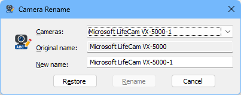

# CameraRename

This small Windows program ist designed to rename the cameras. It is a small helper program for my [PTZControl](https://github.com/xMRi/PTZControl) project, but it can also be used alone. 

It is not necessary to rename the cameras, but it can be helpful if you have more than one camera of the same type and want to distinguish them by name.

**The program must be run with administrator rights, otherwise it will not start!**

## Usage

Just start the program and select the camera you want to rename from the list. Then enter the new name in the text field and click on the "Rename" button. The new name will be applied immediately and is also stored in the registry for later use. If the rename succeeds you get the message "The rename succeeded!" The program exits immediately after renaming the camera. 

No other programs should use a camera before you start the program. It is recommended to start the program immediately after starting the computer, before you start any other program that uses the cameras. This way you can be sure that the rename works without any problems.

The device name in the device manager will not be changed. The program changes the name that is used by DirectShow to access the cameras. This is the name that is used by programs that use DirectShow to access the cameras.

The changes may not affect programs that use hard coded camera types. **The program effects only the the names that are used by DirectShow**. So if you have a program that uses DirectShow to access the cameras, you should see the new names there. If you have a program that uses another interface to access the cameras, it may not see the new names.

## Backup

At program start the original name will be saved in HKLM in the registry. This allows easily to restore the original name. Just start the program and click on the "Restore" and "Rename" button. The original names will be restored immediately.

## Behaviour

Changes are done only to one registry path. 

_HKEY_LOCAL_MACHINE\SYSTEM\CurrentControlSet\Control\DeviceClasses\{65e8773d-8f56-11d0-a3b9-00a0c9223196}_

## Warranty

The program is provided "as is" without any warranty. The author is not responsible for any damage to the system or the cameras. Use the program at your own risk. It is recommended to create a backup of the registry before using the program, especially if you are not sure what you are doing.
